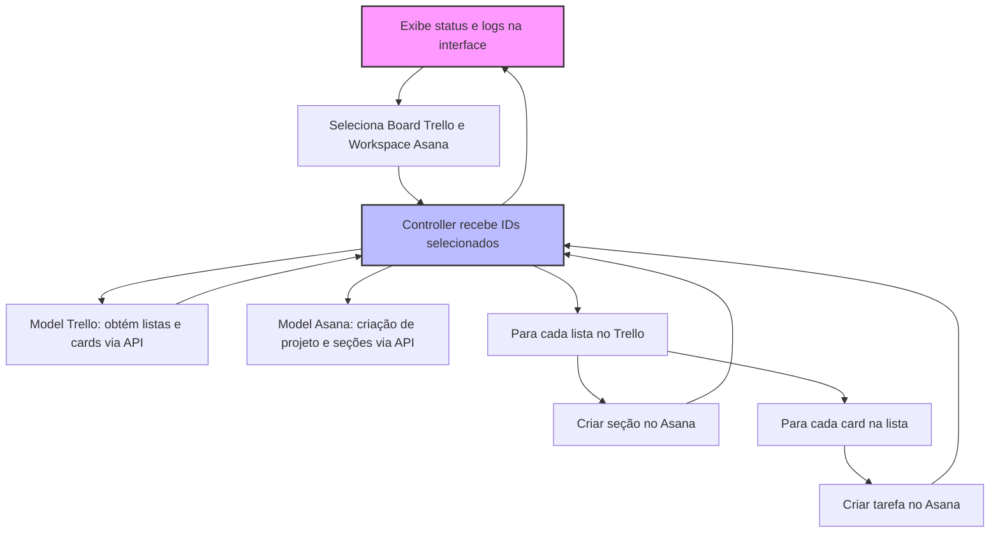

# Integração Trello ↔ Asana - Projeto MVC com Streamlit

Este projeto realiza a sincronização de quadros (boards) do Trello com projetos no Asana, convertendo listas em seções e cards em tarefas. Foi desenvolvido usando arquitetura MVC com interface visual em Streamlit.

## Índice

- [Clonar o Repositório](#clonar-o-repositório)
- [Obter Chaves de API](#obter-chaves-de-api)
- [Configurar Ambiente e Variáveis](#configurar-ambiente-e-variáveis)
- [Executar o Projeto Localmente](#executar-o-projeto-localmente)
- [Executar com Docker](#executar-com-docker)
- [Fluxo de Funcionamento](#fluxo-de-funcionamento)
- [Como a Sincronização Funciona](#como-a-sincronização-funciona)

---

## Clonar o Repositório

```bash
git clone https://github.com/Washington-Vieira/Integra-o-Trello-Asana-.git
cd Integra-o-Trello-Asana-
```

## Obter Chaves de API

### Trello
Acesse https://trello.com/app-key para obter sua API Key.

Clique no link de geração de token na mesma página para criar seu Token com permissão de leitura e escrita.

Asana
Acesse https://app.asana.com.

Clique no seu avatar > "My Profile Settings" > Aba "Apps".

Clique em "Manage Developer Apps" e crie um Personal Access Token (PAT).

Configurar Ambiente e Variáveis
Copie o arquivo config.py e insira suas chaves:

```python
TRELLO_KEY = "Sua_Trello_API_Key"
TRELLO_TOKEN = "Seu_Trello_Token"
ASANA_TOKEN = "Seu_Asana_PAT"
```

Você pode optar por usar .env e python-dotenv para gerenciar variáveis de ambiente (opcional).

Executar o Projeto Localmente
Instale as dependências:

```bash
pip install -r requirements.txt
```

Execute a aplicação:

```bash
python run.py
```
Abra seu navegador em http://localhost:8501 para interagir com a interface.

Executar com Docker
Para rodar via Docker:

Monte as variáveis no arquivo config.py (normalmente não use .env com este exemplo).

Execute:

```bash
docker-compose up --build
```
Acesse http://localhost:8501 para usar a aplicação.

Fluxo de Funcionamento


## Como a Sincronização Funciona
O app lê via API todos os boards disponíveis do Trello do usuário autenticado.

Exibe os nomes desses boards para que o usuário escolha qual sincronizar.

Também busca os workspaces do usuário no Asana para seleção do destino.

Após o usuário escolher, o sistema:

Cria um projeto novo no Asana com o nome do board Trello.

Para cada lista do board Trello, cria uma seção correspondente no projeto Asana.

Para cada card da lista, cria uma tarefa no Asana associada à seção correspondente.

Mensagens e logs são mostrados em tempo real na interface Streamlit.

Licença
Este projeto está licenciado sob a MIT License.

Código

Você pode copiar esse conteúdo e salvar como `README.md` no diretório raiz do seu projeto. Se